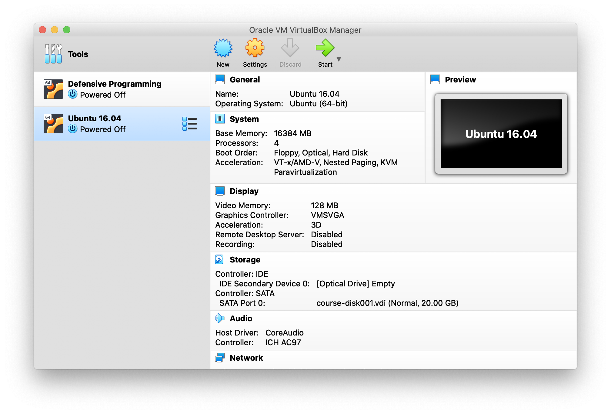
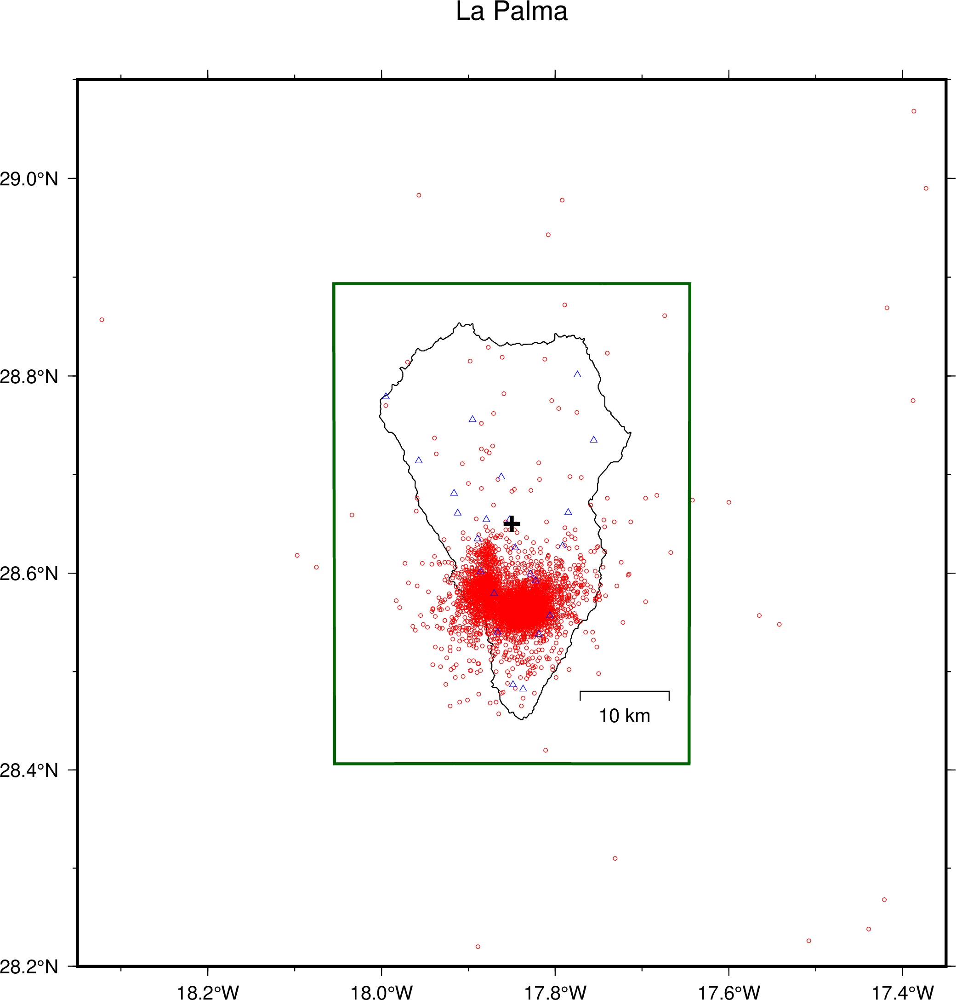

# Tutorials

## 0. Setting up the Linux virtual machine


### Instalación de la máquina virtual

A Linux virtual machine has been created to run the examples of local
earthquake tomography processing.

The file `course.ova` with the virtual machine (6.4 GB) can be downloaded from this
[link](https://www.dropbox.com/s/wr3spoq4fld1swb/course.ova?dl=0).

To install and run the virtual machine the `VirtualBox` software in required.
This software is free and is available for Windows, macOS and Linux computers.
It can be downloaded in the [VirtualBox](https://www.virtualbox.org) home page.

Una vez instalado `VirtualBox` habréis de crear la máquina virtual utilizando el
archivo `course.ova` y siguiendo los siguientes pasos:

1. Abrir la aplicación `VirtualBox`
2. Abrir el menú: `File > Import Appliance`
3. Navegar hasta el directorio donde habéis descargado el archivo `course.ova`,
   seleccionad el archivo y haced click en `Open` y después en `Continue`. Entonces
   aparecerá una ventana similar a esta: 
4. En esta ventana podéis cambiar algunos valores como el nombre de la máquina virtual,
   el número de CPUs, y la RAM. Por el momento se pueden dejar con sus valores por
   defecto y se pueden cambiar más adelante. Hacer click en `Import` para generar la
   máquina virtual. Esto puede tardar unos minutos dependiendo del ordenador.
5. Una vez creada la máquina virtual aparece la ventana para administrar máquinas virtuales:
   
   Si no habéis modificado el nombre, la nueva máquina virtual aparecerá como `Ubuntu 16.04`.
   Haciendo click en el botón `Settings` pueden modificarse los valores de CPUs, RAM, etc de
   la máquina virtual. En cuanto a CPUs, con 1 es suficiente. En cuanto a la RAM, un valor
   entre 1 GB y la mitad de la RAM del ordenador es apropiado. Si vuestro ordenador tiene poca
   RAM (4 GB o menos), intentad no correr ninguna otra aplicación mientras utilizáis la máquina
   virtual.
6. Una vez hayáis modificado los ajustes de la máquina virtual, podéis arrancarla haciendo click
   el `Start` (flecha verde).
   Si la máquina virtual ha arrancado correctamente, podéis hacer click en el icono de la aplicación
   `Terminal` y ejecutar el comando `ls -l`. Entonces vuestra pantalla debería ser similar a esta:
   
7. Una vez inicada la máquina virtual, es conveniente instalar las `Guest Additions`. Ir al menú
   `Devices > Insert Guest Additions CD Image...`. Esto montará un CD virtual que ejecutará 
   automaticamente la instalación de las `Guest Additions`. Para la instalación pedirá el
   password de administrador de la máquina virtual, que es **seismo**. Una vez se hayan instalado, expulsar
   el CD y reiniciar la máquina virtual. La instalación solo ha de realizarse una vez.
8. Si la máquina virtual no ha arrancado correctamente o reacciona muy lentamente, mirad la 
   sección **Posibles problemas** al final de esta página.

La máquina virtual que habéis instalado contiene un entorno de trabajo completo para
aplicaciones de Sismología en general y de Tomografía de Ondas Superficiales en particular.
Tiene instaladas las siguientes aplicaciones:

- `SAC` (Seismic Analysis Code): herramienta interactiva para el análisis de sismogramas
- `SEISAN`: paquete para el procesado de terremotos y redes sísmicas
- `CPS` (Computer Programs in Seismology): colección de programas desarrollados por
   Bob Herrmann (University of Saint Louis) para múltiples aplicaciones en Sismología
   (procesado de ondas superficiales, generación de sismogramas sintéticos, determinación
   de mecanismos focales, etc).
- `GMT5` (Generic Mapping Tools): programas para generar mapas, y gráficos para visualización
   de datos.
- Programas llevar a cabo el proceso completo de tomografía con ondas superficiales.

Cuando hayáis confirmado que la máquina virtual funciona correctamente, entonces podréis
borrar el archivo `course.ova` para ahorrar espacion en disco.

### Posibles problemas:

A pesar de que `VirtualBox` es posiblemente el programa más extendido para crear máquinas
virtuales con distintos sistemas operativos, es posible que os encontréis con algunos
problemas al correr la máquina virtual. Los problemas más comunes son:

#### Utilizando Windows: VirtualBox no puede crear la máquina virtual

Al abrir el archivo `course.ova` con `File > Import Appliance` da un error y no crea la
máquina virtual.

Esto puede deberse a que el archivo `.ova` no se haya descargado correctamente y esté corrompido.
Los archivos `.ova` son en realidad archivos `.tar`, así que pueden descomprimirse utilizando
cualquier programa que pueda leer archivos `.tar`. Para ello cambiar el nombre del archivo
`course.ova` a `course.tar`. Hacer doble-click sobre `course.tar` y comprobar si se descomprime
correctamente. Si esto da algún error significa que probablemente el archivo está corrompido,
así que habría que descargarlo de nuevo.

Si funciona la descompresión, se debería haber creado dos archivos: `course.ovf` y `course-disk001.vmdk`.
El archivo con la extensión `.vmdk` contiene el disco virtual. Es posible entonces crear la máquina
virtual a partir de este archivo por ejemplo siguiendo las instrucciones es este
[link](https://medium.com/riow/how-to-open-a-vmdk-file-in-virtualbox-e1f711deacc4). En nuestro caso
hay que seleccionar Ubuntu 64-bit como el tipo de máquina virtual (no Windows como en el ejemplo).


#### Utilizando Windows: VirtualBox crea la máquina virtual pero al arrancar da un error

Al intentar arrancar la máquina virtual es posible que aparezca un mensaje de error
similar a este:

    VT-x/AMD-V hardware acceleration is not available on your system

Si vuestra CPU es muy antigua puede que no soporte `VT-x/AMD-V` y entonces no podréis utilizar
la máquina virtual. Sin embargo lo más habitual es que `VT-x/AMD-V` no esté activado, y/o que
vuestro ordenador esté utilizando `Hyper-V` que es la tecnología de virtualización de Microsoft
y que suele estar activada por defecto.

Si os encontráis con este error, en este
[link](https://appuals.com/fix-vt-x-amd-v-hardware-acceleration-is-not-available-on-your-system/)
podéis encontrar información detallada sobre como activar `VT-x/AMD-V`.

Si al arrancar la máqina virtual no os da ningún error pero funciona muy lenta, puede
deberse al problema descrito en este 
[link](https://mybyways.com/blog/virtualbox-very-slow-on-windows-10)
y que también tiene que ver con `Hyper-V`.


#### Utilizando macOS

Si tenéis in Mac reciente con pantalla retina, también es posible que VirtualBox funcione 
muy lentamente, incluso en ordenadores con varios núcleos y mucha memoria.

La solución es abrir VirtualBox en modo de baja resolución, siguiendo los siguientes pasos descritos en este
[post de Reddit](https://www.reddit.com/r/virtualbox/comments/houi9k/how_to_fix_virtualbox_61_running_slow_on_mac/):

1. Navigate to Apps folder. Choose VirtualBox.app
2. Right click on VirtualBox.app, Show Package Contents.
3. Contents -> Resources -> VirtualBoxVM.app (right click -> Get info)
4. Check the "Open in Low Resolution" checkbox.
5. Run the Virtual Machine in 100% scale mode and with the "VBoxSVGA" graphics controller selected


## 1. Selecting a region for tomography

The first step for local earthquake tomography is to select the model region.
This is done by adjusting the following parameters in the parameter file,
that in our example is called `lapalma_gradient_coarse.prm`:

```
# Origin of the local coordinates
#
lat0=28.65                             # latitude of the origin of coordinates
lon0=-17.85                            # longitude of the origin of coordinates
#angle=                                # rotation angle for oblique projection (undefined for standard Transverse Mercator)
#
# Boundaries of the map where the model region (box) is included (only needed for box.sh)
#
lat1=28.2
lat2=29.1
lon1=-18.35
lon2=-17.35
#
# Box dimensions in km, referred to (lat0, lon0)
# - For true center x2=-x1 and y2=-y1
# - For lower left corner make x1=y1=0 and x2=xlen, y2=ylen
#
x1=-20
x2=20.0
y1=-27.0
y2=27.0
baseElev=-3.0                          # top of model (negative above sea level)
zmax=45.0                              # bottom of model
```

In order to select the model volume for tomography we also need to plot the earthquakes
and stations in our dataset. The station and bulletin (earthquakes and arrival times) files
are specified in these parameters:

```
#
# Station and event files
#
stations=$topdir/stations/canarias_2022.sta
bulletin=$topdir/bulletin/IGN_2013_present.nor
format=nordic
```

Once we have set the above parameters, we run the script `box6.sh` that plots
the stations, earthquakes, and rectangular box using `GMT`:

    $ box6.sh lapalma_gradient_coarse.prm

This generates a PostScript file called `box.ps` that can be visualized
using for example `gv`:

    $ gv box.ps &

The parameters that define the center of the model and the size of the box in x and y can
be adjusted by trial and error until a suitable box is found such as the following:




## 2. Selecting earthquakes and arrival times for tomography

Once a suitable model volume (box) has been obtained, we can select well recorded
earthquakes for the tomography. This is done by setting the following block of parameters
in the parameter file:

```
#
# Selection parameters for tomography
#
mag_min=-2.0
mag_max=9.9
rms_min=0.0
rms_max=2.0
p_phases_min=8
p_phases_max=9999
p_weight_best=0
p_weight_worst=3
s_phases_min=4
s_phases_max=9999
s_weight_best=0
s_weight_worst=3
distance_min=0.0
distance_max=350.0
gap_min=0
gap_max=200
close_station=1
use_s_waves=1
use_polarities=1
```

These parameters are described in more detailed in this
[link](https://avillasenorh.github.io/PStomo_documentation/parameters/)

Once we have set the above parameters, we run the script `let_selection.sh` that 
runs the selection program `seleq` and writes the selected earthquakes in
the format required by the tomography code `pstomo_eq`:

    $ let_selection.sh lapalma_gradient_coarse.prm

This generates a PostScript file called `dataset.ps` that can be visualized
using for example `gv`:

    $ gv dataset.ps &


In addition to the PostScript file, the script `let_selection.sh` also generates
3 input files required by the tomography code:

- `lapalma_src.in`: file with earthquake (and explosion) hypocenters
- `lapalma_stat.in`: file with station coordinates
- `lapalma_tt.in`: file with P (and S) arrival times

The format of these files is described in more detail in this
[link](https://avillasenorh.github.io/PStomo_documentation/formats/).

## 3. Running the tomography code

To run the tomography code first we need to provide an initial 1D model.
This is indicated in the following parameter:

```
# Initial velocity model
#
initial_model=$topdir/1Dmodels/lapalma_gradient01.prm   # full path so it also works in offset-and-average runs
```

The format of the 1D model file is:

```
 -6.0 4.7  # first column is depth in km, second column is P-wave velocity
  0.0 5.5
 10.0 6.3
 18.0 8.0
100.0 8.2
```

Then the following parameters indicate the version of the tomography code to run (always `pstomo_eq`)
and the number of iterations. If more than one run is specified in the parameter file (e.g. multiple
values of smoothing) these can be run sequentially or in parallel (if the resources of the computer
allow it).

```
#
# Parameters for tomography codes
#
tomo_code=pstomo_eq
number_of_iterations=10                          # number of iterations
parallel=0                                       # run different smoothers sequentially or in parallel
```

The following parameters control the size of the travel time and model grid:

```
#
# model parameters
#
h=0.3                                            # travel time grid spacing in km
magx=10                                          # number of travel time cells for each model cell in X direction
magy=10                                          # number of travel time cells for each model cell in Y direction
magz=5                                           # number of travel time cells for each model cell in Z direction
x_div=3                                          # number of divisions for offset and average in X direction
y_div=3                                          # number of divisions for offset and average in Y direction
z_div=3                                          # number of divisions for offset and average in Z direction
```

The following parameters control the travel time computations:

```
#
# travel time parameters
#
maxres=0.75                                      # maximum allowed P residual (seconds)
maxsres=1.50                                     # maximum allowed S residual (seconds)
maxOffset=100.0                                  # maximum distance to calculate travel times (km)
Podvin_Lecomte=1
```

The following parameters control the P and S travel time inversion parameters:

```
#
# P inversion parameters
#
invert=1                                         # invert velocity model (1=true, 0=false)
interpolate=1                                    # interpolate model into travel time grid (1=true, 0=false)
#smoother="100.0 75.0 50.0 40.0 30.0 20.0 10.0"  # list with different values of smoother to test
smoother="10.0"                                  # list with different values of smoother to test
# S inversion parameters
#
swave_flg=1
ps_wght_type=0
ps_wght=2.00
vpsreg_flg=1
vps_reg=50.0
vps_ratio=1.77
```

Finally the following parameters control the inversion parameter for earthquake relocations:

```
#
# earthquake inversion parameters
#
eqloc=1                                          # invert for earthquake relocations (1=true, 0=false)
min_z=-0.5                                       # minimum depth (defined in seleq.in???)
max_dh=5.0                                       # maximum allowed change in epicenter per iteration (km)
max_dt=2.0                                       # maximum allowed change in origin time per iteration (seconds)
no_earthq=0
no_shots=1
```

There are other parameters that affect the LSQR method used to invert the tomography matrix,
but the default values are usually appropriate. A more detailed description of all the 
parameters is provided in this
[link](https://avillasenorh.github.io/PStomo_documentation/parameters/)

Once we have set all these parameters, we run the tomography using the following command:

    $ let_run_pstomo.sh lapalma_gradient_coarse.prm &

The output of each run is generated in a directory with the following naming schema:
`run_parfilename_smoother_xcellsize_ycellsize`, where:

- `parfilename` is the prefix of the parameter file (`lapalma_gradient_coarse` for the
   parameter file `lapalma_gradient_coarse.prm`.
- `smoother` is the value of the smoothing constraint used in this run (e.g. `010.0` for
   a smoothing value of 10.0)
- `xcellsize` is the size in km of the model cells in the X directory (03.00 for a cell
   size of 3.0 km)
- `ycellsize` is the size in km of the model cells in the Y directory

An example of run directory then could be: `run_lapalma_gradient_coarse_010.0_03.00_0.30`

Inside this directory we can find the following files:

- `pm.i`: P model (in binary format) for iteration `i`.
- `pc.i`: P coverage (in binary format) for iteration `i`.
- `sm.i`: S model (in binary format) for iteration `i`.
- `sc.i`: S coverage (in binary format) for iteration `i`.
- `src.i`: Earthquake relocations for iteration `i`.
- `log`: log file with output of `pstomo_eq`


## 4. Displaying the results

The script `let_plot_pstomo.sh` can be used to plot the results of the tomography. The syntax of
the script is:

    $ let_plot_pstomo.sh parameter_file run_directory [ plot_type [ model [ iteration ] ] ]

- `plot_type` can be `layer` (default), `profile`, or `profile_map`
- `model` can be `p` (default) or `s`.
- `iteration` is the iteration to plot (default is the last iteration). This option can
   be useful to plot intermediate results before a long run finishes.

This generates PostScript files in the run directory with the specified plots. These PostScript
files can be visualized with `gv`.

## Example 1. Local earthquake tomography

## Example 2. Cross-hole tomography

## Example 3. Traveltime tomography with statics

## Example of a complete parameter file

```
# File: la_palma_gradient_coarse.prm
# Parameters to adjust the study region                                 
# Prefix for filenames related to this dataset
#
topdir=${HOME}/Projects/LET/La_Palma
prefix=lapalma                         # prefix for selection and parameter files
label="La Palma"                       # title for plots
#
# Origin of the local coordinates (normally "center" of the model, or lower-left corner)
#
lat0=28.65                             # latitude of the origin of coordinates
lon0=-17.85                            # longitude of the origin of coordinates
#angle=                                # rotation angle for oblique projection (undefined for standard Transverse Mercator)
#
# Boundaries of the map where the model region (box) is included (only needed for box.sh)
#
lat1=28.2
lat2=29.1
lon1=-18.35
lon2=-17.35
#
# Box dimensions in km, referred to (lat0, lon0)
# - For true center x2=-x1 and y2=-y1
# - For lower left corner make x1=y1=0 and x2=xlen, y2=ylen
#
x1=-20
x2=20.0
y1=-27.0
y2=27.0
baseElev=-3.0                          # top of model (negative above sea level)
zmax=45.0                              # bottom of model
#
# Selection dimension (can be smaller than box)
#
xs_1=$x1
xs_2=$x2
ys_1=$y1
ys_2=$y2
zs_1=0.5
zs_2=40.0
#
# Map scale;  used also to obtain geographical coordinates of the corners
#
#scale="1:5000000"
scale=16.0
#
# Station and event files
#
stations=$topdir/stations/canarias_2022.sta
bulletin=$topdir/bulletin/IGN_2013_present.nor
format=nordic
#
topo_grid=$topdir/gridfiles/lapalma_03s.nc
profiles=$topdir/profiles/W-E_profiles.list
#profiles=$topdir/profiles/S-N_profiles.list
#
# Selection parameters for tomography
#
mag_min=-2.0
mag_max=9.9
rms_min=0.0
rms_max=2.0
p_phases_min=8
p_phases_max=9999
p_weight_best=0
p_weight_worst=3
s_phases_min=4
s_phases_max=9999
s_weight_best=0
s_weight_worst=3
distance_min=0.0
distance_max=350.0
gap_min=0
gap_max=200
close_station=1
use_s_waves=1
use_polarities=1
#
# Initial velocity model
#
initial_model=$topdir/1Dmodels/lapalma_gradient01.prm   # full path so it also works in offset-and-average runs
#
# Parameters for tomography codes
#
tomo_code=pstomo_eq
number_of_iterations=10                          # number of iterations
parallel=0                                       # run different smoothers sequentially or in parallel
#
# model parameters
#
h=0.3                                            # travel time grid spacing in km
magx=10                                          # number of travel time cells for each model cell in X direction
magy=10                                          # number of travel time cells for each model cell in Y direction
magz=5                                           # number of travel time cells for each model cell in Z direction
x_div=3                                          # number of divisions for offset and average in X direction
y_div=3                                          # number of divisions for offset and average in Y direction
z_div=3                                          # number of divisions for offset and average in Z direction
#
# travel time parameters
#
maxres=0.75                                      # maximum allowed P residual (seconds)
maxsres=1.50                                     # maximum allowed S residual (seconds)
maxOffset=100.0                                  # maximum distance to calculate travel times (km)
Podvin_Lecomte=1
#
# P inversion parameters
#
invert=1                                         # invert velocity model (1=true, 0=false)
interpolate=1                                    # interpolate model into travel time grid (1=true, 0=false)
#smoother="100.0 75.0 50.0 40.0 30.0 20.0 10.0"  # list with different values of smoother to test
smoother="10.0"                                  # list with different values of smoother to test
# S inversion parameters
#
swave_flg=1
ps_wght_type=0
ps_wght=2.00
vpsreg_flg=1
vps_reg=50.0 
vps_ratio=1.77
#
# earthquake inversion parameters
#
eqloc=1                                          # invert for earthquake relocations (1=true, 0=false)
min_z=-0.5                                       # minimum depth (defined in seleq.in???)
max_dh=5.0                                       # maximum allowed change in epicenter per iteration (km)
max_dt=2.0                                       # maximum allowed change in origin time per iteration (seconds)
no_earthq=0
no_shots=1
#
# output
#
verbose=1
ttlog=0                                          # output synthetic travel times (1=true, 0=false)
eqinfo=0                                         # output log file with all travel time residuals (0=true, 1=false)
timefile=0                                       # output travel time binary files for all stations (0=true, 1=false)
#
# LSQR
#
ilsqr=500                                        # number of LSQR iterations
truncater=0.001                                  # SVD truncater for earthquake location
max_cond_num=500.0
reortho_flg=0
UVout_flg=0
#
# refine model with depth
#
detail=0
det_z=1.0
det_magz=2
reduce=0
red_z=3.0
red_magx=2
red_magy=2
red_magz=2
#
# others
#
msd=0.0                                          #
relative=0
cross_grad=1
cross_grad_wght=200.0
use_pert_file=0
#
# not used
#
errlog=0                                         # output log file with unused travel times (0=true, 1=false)
reslog=1                                         # output log file with all travel time residuals (0=true, 1=false)
twght=0                                          # weight travel times by pick quality (0=true, 1=false)
xwt=1.0                                          # weight factor of smoothing in X direction
ywt=1.0                                          # weight factor of smoothing in X direction
zwt=1.0                                          # weight factor of smoothing in X direction
#
# Parameters for checkerboard tests
#
synthetic_anomaly=10.0                           # magnitude of synthetic spike anomaly (in %)
x_spike=4                                        # size of spike in X direction (in cells)
y_spike=4                                        # size of spike in Y direction (in cells)
z_spike=4                                        # size of spike in Z direction (in cells)
x_buffer=4                                       # number of cells with 0 anomaly between spikes in X direction
y_buffer=4                                       # number of cells with 0 anomaly between spikes in Y direction
z_buffer=4                                       # number of cells with 0 anomaly between spikes in Z direction
x_offset=0                                       # extra offset of skipes in X direction (in cells)
y_offset=0                                       # extra offset of skipes in Y direction (in cells)
z_offset=4                                       # extra offset of skipes in Z direction (in cells)
#
# GMT5 plotting parameters
#
start_layer=3
end_layer=20
paper_size=a4
cptdir=${HOME}/data/cpt
p_cpt=$cptdir/16%_panoply.cpt
s_cpt=$cptdir/16%_panoply.cpt
vpvs_cpt=$cptdir/vpvs_drywet.cpt
pc_cpt=$cptdir/hitc_20.cpt
sc_cpt=$cptdir/hitc_20.cpt
orientation="-P"
features="-Df -A10/1/1 -W0.5p -N2/0.5p,gray,- -L-17.72/28.48/$lat0/10"
include_plot=$topdir/geology/faults.sh
xa=0.2
xt=0.1
xg=0
ya=0.2
yt=0.1
yg=0
axis=WeSn
sta_symbol="-St0.15c -L -W0.25p,0/0/255"
sta_bad_symbol="-Si0.15c -L -G0"
eq_symbol="-Sc0.07c -L -W0.25p,255/0/0"
eq_bad_symbol="-Sc0.07c -L -W0.25p,255/100/255"
ex_symbol="-Sx0.07c -L -W0.25p,255/0/255"
gmt_verbose=
#
# vertical cross sections
#
dp=0.2
pwidth=10.0
offset=5.0
ha=10
ht=5
va=10
vt=5
p_cpt_absolute=$cptdir/vp_crimson3.cpt
s_cpt_absolute=$cptdir/vs.cpt
topo_cpt=$cptdir/dp5.cpt
eq_symbol1="-Sc0.1c -L -W0.25p,255 -G0"
sta_symbol1="-Si0.2c -L -W0.25p -G255/0/255"
```

